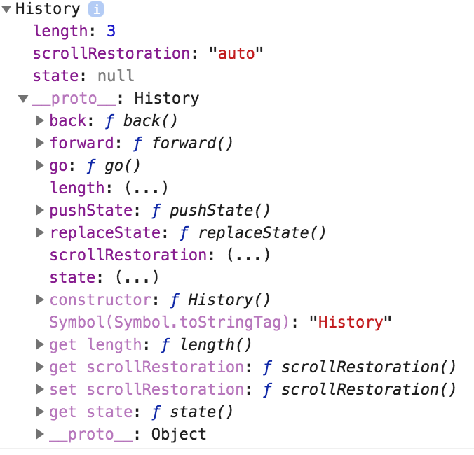

# History Interface

## 打印history对象

## histtory对象简介
- `History`是一个构造函数，用来定义具有共同属性和方法的一组对象。
- `history`是一个实例化的`History`，由`new History()`而来。
- `history`用来创建当前tab内的会话([session](../computer-science/session.md))记录。
- `histroy`接口提供了操作浏览器中的session记录的属性和方法。
- session记录由history对象创建
- session记录记录了当前tab内访问过的页面
- history对象表示`session history entries`的一个列表。
- 每一个`session history entry`都包含：
  - url
  - state obj
  - title
  - document obj
  - form data
  - 滚动位置

## 属性
- history.length

## 方法
- history.go(): Loads a page from the session history, identified by its relative location to the current page
- history.back():Goes to the previous page in session history
- history.forward():Goes to the next page in session history
- history.pushState():Pushes the given data onto the session history, with the given title, and, if provided, the given URL.
- history.replaceState() : Updates the current entry in the session history to have the given data, title, and, if provided, URL.
