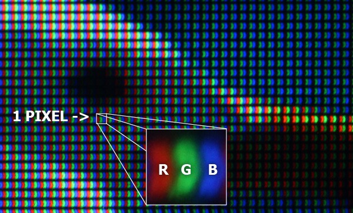
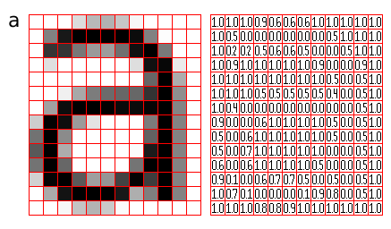
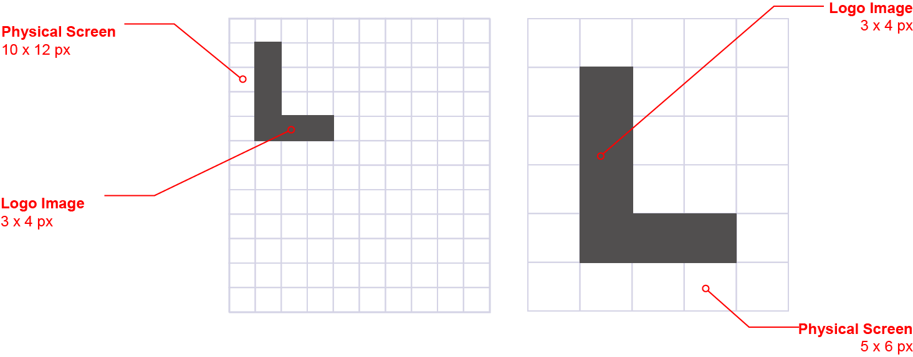

# Pixel

## iPhone手机屏幕参数
2019年01月统计

|手机|diagonal|pixels|PixelPerInch|DevicePixelRatio|
|-|-|-|-|-|
|iPhone 5|4.0|1136×640|326|2|
|iPhone 5s|4.0|1136×640|326|2|
|iPhone SE|4.0|1136 x 640|326|2|
|iPhone 6|4.7|1334 x 750|326|2|
|iPhone 6s|4.7|1334 x 750|326|2|
|iPhone 7|4.7|1334 x 750|326|2|
|iPhone 8|4.7|1334 x 750 |326|2|
|iPhone 6 Plus|5.5|1920 x 1080|401|3|
|iPhone 6s Plus|5.5|1920 x 1080|401|3|
|iPhone 7 Plus|5.5|1920 x 1080|401|3|
|iPhone 8 Plus|5.5|1920 x 1080|401|3|
|iPhone X|5.8|2436 x 1125|458|3|
|iPhone XR|6.1|1792 x 828|326|3|
|iPhone XS|5.8|2436 x 1125|458|3|
|iPhone XS MAX|6.5|2688 x 1242|458|3|

## 参考
[https://blog.specctr.com/pixels-physical-vs-logical-c84710199d62](https://blog.specctr.com/pixels-physical-vs-logical-c84710199d62)

## Pixel
- The word `PIXEL` is an abbreviation for `picture element`.
- `Pixel`是数字图像的基本单位
- `Pixel`理解起来比较复杂，原因在于：
  - `Physical Pixel`：describe the concept in real world
  - `Logical Pixel`: describe the concept in digital world

## What exaclty is a PHYSICAL PIXEL
- `physical pixel`就是你看到的从电子屏幕发出的光
- 一个物理像素就是电子屏幕上的一块区域
- 这个区域能发出一支单色的光线（实际由红绿蓝三支构成）
- 这个区域必须不可分割
- 任何设备的物理像素数量都是固定的
- `physical`指的是设备屏幕玻璃后面真实存在的光线的这一事实。

## What on earth is a LOGICAL PIXEL
- `logical pixel`：我们在PS中谈论图片尺寸时所使用的单位就是逻辑像素。
- `logical`指一种事实：这些像素仅仅是一些信息
- 这些信息在表示图像的网格的某个位置上指定了一个颜色值
- `logical pixel`自身没有物理尺寸：如果不指定图片显示的context,没人知道一个逻辑像素为100px*100px的图像有多大。

## Why logical pixel is required?
- Let's pretend there was just one kind of pixel
- Imagine a 3*4 pixel logo is to be displayed under a 5*6 pixel screen(with same dimension but lower resolution)
- Imagine a 3*4 pixel logo is to be displayed under a 10*12 pixel screen(with same dimension but higher resolution)
- An image would look tiny because of the higher resolution screen.
- `logical pixel` is the way we can encode an image by specifying logical pixel's position and colors.
- The devices can specify how that informations is mapped to each of the device's physical pixels.
- To accomplish this mapping,the device manufactures specifies a device pixel ratio
- `DevicePixelRatio` is just the amount of physical pixels necessary to display a logical pixel.
- to keep the image size under different resolution devices.

