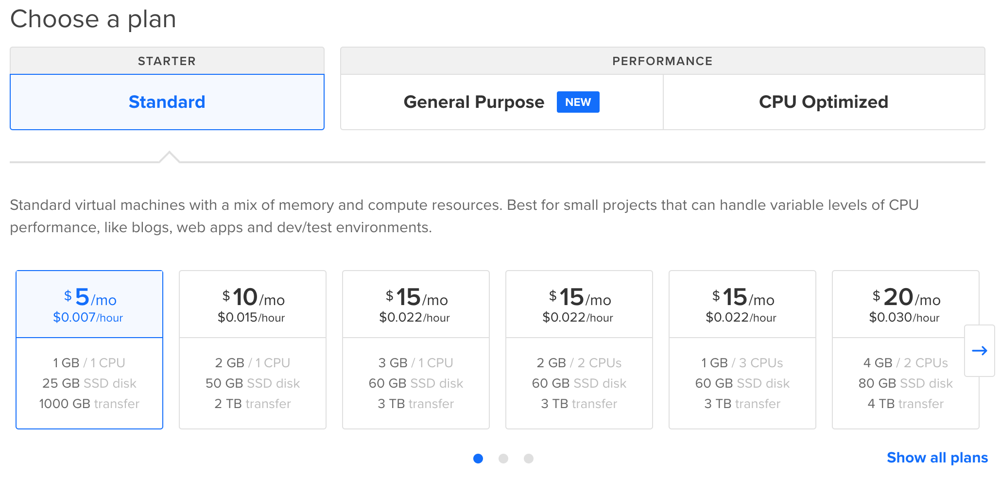
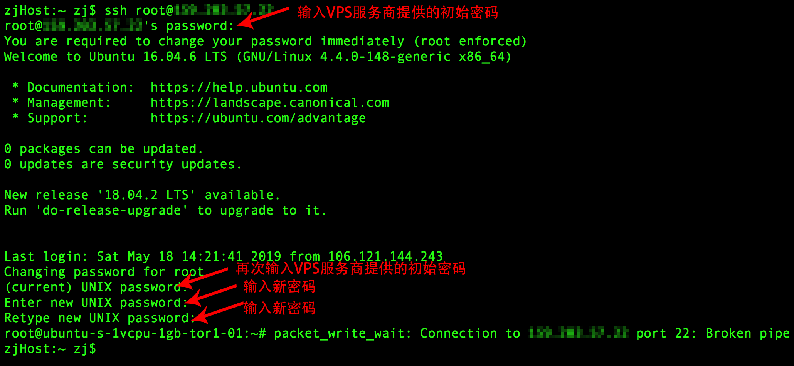
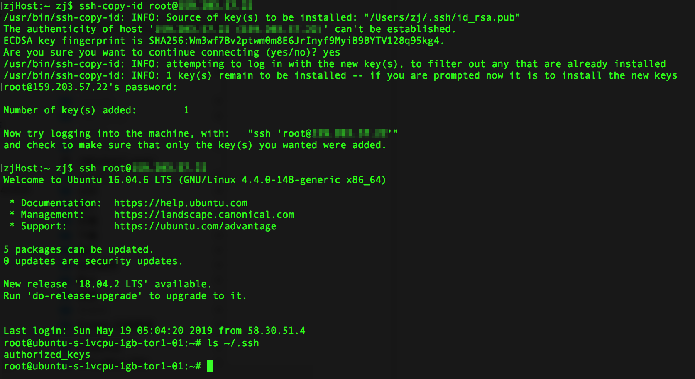

# SSH

**SSH是"Secure Shell"或"Secure Socket Shell"的缩写，意思是"安全的Shell"或"加密的网络"。SSH协议是一种基于Unix的指令接口和协议。广泛用于在不安全的网络上安全地从一台机器登录到另一台机器。**

注：由于SSH协议基于Unix，在Windows系统中使用SSH时，需安装一个叫PuTTY的软件

## Why SSH?
**安全性提高**

1995年，芬兰学者Tatu Ylonen设计了SSH协议，将登录信息和传输的数据全部加密。传统的网络服务程序，如：ftp、pop和telnet在本质上都是不安全的，因为它们在网络上用明文传送口令和数据，别有用心的人非常容易就可以截获这些口令和数据。SSH在安全性和功能性上有着重大改进，成为互联网安全的一个基本解决方案，目前已经成为Linux系统的标准配置。

**速度提升**

使用SSH，还有一个额外的好处就是传输的数据是经过压缩的，所以可以加快传输的速度。


## SSH的一个使用场景

- 本地： MacBook
- 远程：DigitalOcean VPS服务器一台



注意：在购买VPS服务器创建Droplet(实例)的时候，有一个`Add your SSH keys`,即是否使用公钥验证登录。

- 如果是正式使用，推荐选择该项。
- 如果是初次学习，可以不选择该项：DigitalOcean会发送用户名、密码和IP地址到你的信箱。

>>欢迎使用我的推荐链接: ) 购买DigitalOcean VPS,有优惠。


## SSH提供两种级别的安全验证
- 基于口令的安全验证：

只要你知道自己帐号和口令，就可以登录到远程主机。所有传输的数据都会被加密，但是不能保证你正在连接的服务器就是你想连接的服务器。可能会有别的服务器在冒充真正的服务器，也就是受到“中间人”这种方式的攻击。

- 基于密匙的安全验证
需要依靠密匙，也就是你必须为自己创建一对密匙，并把公用密匙放在需要访问的服务器上。如果你要连接到SSH服务器上，客户端软件就会向服务器发出请求，请求用你的密匙进行安全验证。服务器收到请求之后，先在该服务器上你的主目录下寻找你的公用密匙，然后把它和你发送过来的公用密匙进行比较。如果两个密匙一致，服务器就用公用密匙加密“质询”（challenge）并把它发送给客户端软件。客户端软件收到“质询”之后就可以用你的私人密匙解密再把它发送给服务器。
用这种方式，你必须知道自己密匙的口令。但是，与第一种级别相比，第二种级别不需要在网络上传送口令。
第二种级别不仅加密所有传送的数据，而且“中间人”这种攻击方式也是不可能的（因为他没有你的私人密匙）。但是整个登录的过程可能需要10秒。

## SSH基于口令登录远程主机
**第一步：找到登录密码**

当你创建好VPS实例后，DigitalOcean服务商会发送一封包含登录信息的邮件到你注册的信箱里。

**第二步：登录远程主机**

`ssh`: 用于在两台电脑之间建立安全连接通道传输数据。

```
$ ssh username@remote_host_ip
```
基于口令的验证，初次登录成功后，需要修改登录密码：



## SSH基于秘钥登录远程主机

**第一步：创建秘钥对**

`ssh-keygen`命令: 即ssh key generate，用于为SSH创建授权秘钥，它是SSH协议套装的标准组件。

1. 不使用参数创建秘钥
```
$ ssh-keygen
```
运行`ssh-keygen`命令后，会有几个提示，可以一路按`enter`键跳过，保持默认：
- 默认存储路径: /Users/zhangsan/.ssh/
- `id_rsa`: 默认秘钥文件名
- `id_rsa.pub` : 默认公钥文件名
- `passphrase` :为SSH秘钥设置密码


2. 使用参数创建秘钥

```
$ ssh-keygen -f ~/tatu-key-rsa -t rsa -b 521
```
- `-f`: Specifying the file in which to store the key.指定文件
- `-t`: Chose an Algorithm type 指定一种加密算法
  - rsa
  - dsa
  - ecdsa
  - ed25519
- `-b`: Choose the key size 指定文件大小

**第二步：Copy the public key to Server**
方法一：使用`ssh-copy-id`拷贝公钥

```
$ ssh-copy-id username@remote_host_ip
```


方法二：使用SSH拷贝公钥
如果你的电脑没有`ssh-copy-id`工具，可以使用ssh
```
cat ~/.ssh/id_rsa.pub | ssh username@remote_host "mkdir -p ~/.ssh && touch ~/.ssh/authorized_keys && chmod -R go= ~/.ssh && cat >> ~/.ssh/authorized_keys"

```

**第三步：授权Server使用SSH Keys**
```
$ ssh username@remote_host_ip
```
接下来输入`yes`，然后回车
```
Output
The authenticity of host '203.0.113.1 (203.0.113.1)' can't be established.
ECDSA key fingerprint is fd:fd:d4:f9:77:fe:73:84:e1:55:00:ad:d6:6d:22:fe.
Are you sure you want to continue connecting (yes/no)? yes
```
**第四步：禁用密码**

如果你现在可以不使用密码登录远程服务器，那说明你已经成功的设置了SSH-key授权给你的服务器账户。然而，你的密码授权机制仍然有效，意味着不安全。

```
sudo nano /etc/ssh/sshd_config

```
编辑sshd_config文件
```
PasswordAuthentication no
```
重启SSH服务
```
$ sudo systemctl restart ssh
```
测试密码登录
```
ssh username@remote_host
```


## 参考

- 
