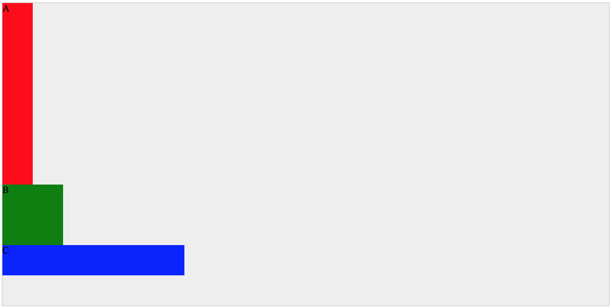

# Flexbox详解

## 这里有三个普普通通的DIV元素
效果:


HTML代码：
```
<body>
    <div class="container">
      <div class="item1">A</div>
      <div class="item2">B</div>
      <div class="item3">C</div>
    </div>
</body>
```
CSS代码：
```
<style>
  .container{
      max-width:1000px;
      height:500px;
      margin: 0 auto;
      border:1px solid #ccc;
      background-color: #eee;
  }
  .item1{
    width:50px;
    height:300px;
    background-color:red;
  }
  .item2{
    width:100px;
    height:100px;
    background-color:green;

  }
  .item3{
    width:300px;
    height:50px;
    background-color:blue;
  }
</style>
```


## Flexbox布局的目标
提供一种更 **有效** 的布局方式。
- 在一个容器内
- 分配空间
- 对齐元素
- 即使元素的尺寸未知或是动态的

## Flexbox实现的思想
赋予父容器一种 **控制子元素尺寸** （意味着分配剩余空间）的能力。
- 主轴为横轴时：子元素的width受父元素控制，height不受父元素控制
- 主轴为纵轴时：子元素的height受父元素控制，width不受父元素控制


## Flexbox的特点
- 方向不固定:传统的布局(块垂直排列 inline水平排列)缺乏灵活性
- flexbox是一个模块，而非一个属性，是一整套属性


## Terminology
- flex container : 父元素
- flex items： 子元素
- main axis : flex items排列参照的轴。取决于`flex-direction`属性
- main start: flex items排列的起点
- main end: flex items排列的终点
- main size: flex items的width或height
- cross axis: 与main axis 垂直的轴叫cross asis
- cross start: flex lines堆积的起点
- cross end: flex lines堆积的终点
- cross size: flex items的height或width

## container的属性
|序号|property|描述|属性值|
|-|- | - | - |
|1|display|定义flex container。为所有直接子元素激活弹性环境。|`flex` `inline-flex`|
|2|flex-direction|建立主轴|`row` `row-reverse` `column` `column-reverse`|
|3|flex-wrap|flex items是否换行|`nowrap` `wrap` `wrap-reverse`|
|4|justify-content|沿主轴分配空间(元素之间的空间）|`flex-start` `flext-end` `center` `space-between` `space-arountd` `space-evenly`|
|5|align-content|沿纵轴分配空间（行之间的空间，单行无效）|`flex-start` `flex-end` `center` `space-between` `space-around` `stretch`|
|6|align-items|沿纵轴分配空间(单行有效）|`flex-start` `flex-end` `center` `stretch` `baseline`|

- `column`属性对flex container无效

## items的属性
|序号|property|描述|属性值|
|-|- | - | - |
|1|order|控制items的排列顺序|integer：默认为0，负值有效|
|2|flex-grow|分配剩余空间给谁|number：默认为0,负值无效|
|3|flex-shrink|收缩元素|number:默认为0,负值无效|
|4|flex-basis|定义元素的基尺寸|默认为auto:依照width和height content:依照内容 长度值 关键词|
|5|align-self|覆盖align-items的属性，为单个元素设置|`flext-start` `flex-end` `center` `stretch` `baseline`|

```
<style>
        .container{
            max-width:1000px;
            height:500px;
            margin: 0 auto;
            border:1px solid #ccc;
            background-color: #eee;
            /* 激活flex context。 */
            display: flex;
            /* 建立主轴：row(default) row-reverse column column-reverse */
            flex-direction:row;
            /* 控制换行:nowrap(default) wrap wrap-reverse(沿纵轴逆向排列) */
            flex-wrap:wrap;
            /* 沿主轴分配空间 flex-start */
            justify-content:flex-start;
            /* 沿纵轴分配空间 flex-start */
            align-content:flex-start;
            /* 沿纵轴分配空间 flex-start */
            align-items: flex-end;
        }
        .items{
            flex-basis:0;
            /* height:98px; */
            background-color:red;
            border:1px solid black;
            flex-grow:1;
            /* flex-shrink:.3 */

        }
        .item1{
            flex-grow:.3
            /* flex-shrink:2 */

        }
        .item2{
            flex-grow:.5;
            align-self:flex-start;
        }
        .item3{
            flex-grow:.2;
        }
    </style>
</head>
<body>
    <div class="container">
        <div class="items item1">A</div>
        <div class="items item2">B</div>
        <div class="items item3">C</div>
        <!-- <div class="items item4">D</div>
        <div class="items item">E</div>
        <div class="items item">F</div>
        <div class="items item">G</div>
        <div class="items item">H</div>
        <div class="items item">I</div>
        <div class="items item">G</div>
        <div class="items item">I</div>
        <div class="items item">G</div>
        <div class="items item">I</div>
        <div class="items item">G</div> -->
    </div>
</body>
```

## 参考
- [css-tricks](https://css-tricks.com/snippets/css/a-guide-to-flexbox/)
