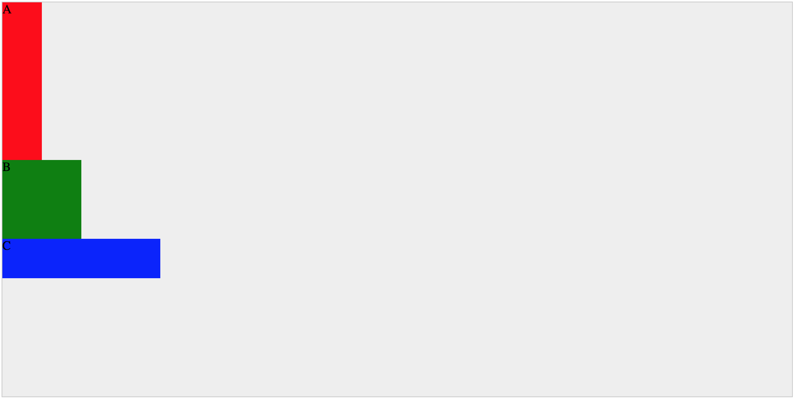
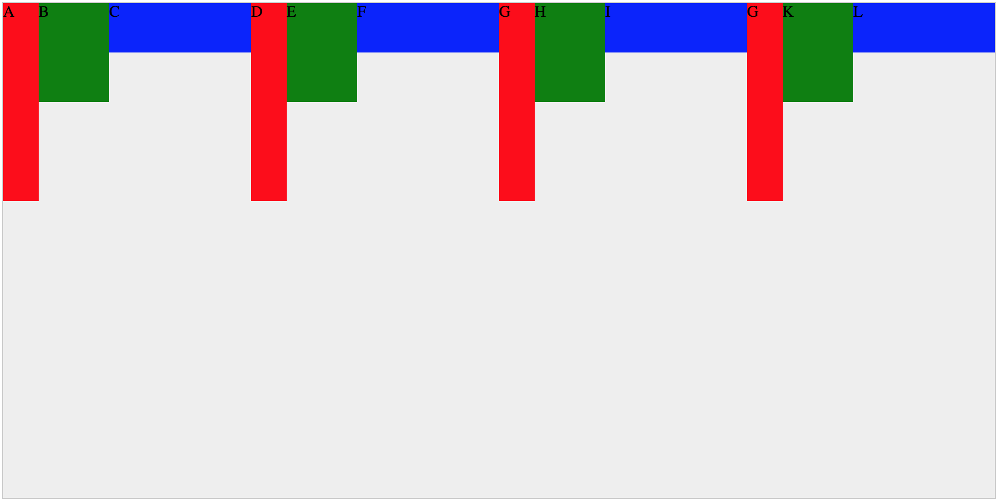

# Flexbox详解
- 核心总结
  - justify-content: 说白了就是“**沿主轴方向调整行内的空隙**”
  - align-items: 说白了就是"**沿垂直轴方向调整行内的空隙**"
  - align-content: 说白了就是"**调整行间/列间空隙**"
- 前言
  - 如果不了解CSS布局的知识，请点这里：[《CSS的布局模型》](css-layout.md)
  - 本文编写基于CSS-tricks的文章（[A Complete Guide to Flexbox](https://css-tricks.com/snippets/css/a-guide-to-flexbox/)）和我自己的理解。如果错误请指正。

## 常规布局
常规布局指基于`block`或`inline-blok`的布局
- flow
- float
- position

常规flow布局:



HTML：
```
<body>
    <div class="container">
      <div class="item1">A</div>
      <div class="item2">B</div>
      <div class="item3">C</div>
    </div>
</body>
```

CSS：
```
<style>
  .container{
      max-width:1000px;
      height:500px;
      margin: 0 auto;
      border:1px solid #ccc;
      background-color: #eee;
  }
  .item1{
    width:50px;
    height:200px;
    background-color:red;
  }
  .item2{
    width:100px;
    height:100px;
    background-color:green;
  }
  .item3{
    width:200px;
    height:50px;
    background-color:blue;
  }
</style>
```

## 常规布局特征
- 元素的尺寸不可自动改变
- 元素的排列与方向有关
  - 块元素：自上而下排列
  - 内联元素：自左而右排列

## flexbox布局特征：
- 元素的尺寸可自动改变
- 元素的排列与方向无关
  - 子元素：在水平垂直方向上可任意排列

## flexbox的术语：


|terminology|说明|terminology|说明|
|-|-|-|-|
|flex container| 父元素|||
|flex items| 子元素|||
|main axis|主轴(子元素排列参照的轴)|cross axis|垂直轴(与当前主轴垂直的轴)|
|main start|子元素排列的起点(主轴方向)|cross start|子元素排列的起点(垂直轴方向)|
|main end|子元素排列的终点(主轴方向)|cross end|子元素排列的终点(垂直轴方向)|
|main size|父元素尺寸(主轴方向)|cross size|父元素尺寸(垂直轴方向)|

## display:flex (父元素属性)
效果：


CSS：
```
.container{
  display: flex;
}
```
为父元素设置`display:flex`后，发生了哪些事情？
- 取消了父元素(`.container`)上的流动布局模型
- 在父元素上建立了flex布局模型
  - 建立了flex-container和flex-items
  - 建立了main-axis和cross-axis
  - 建立了start和end
  - main-size由width或height决定
  - cross-size由height或width决定


## display:inline-flex(父元素属性)
效果：


CSS：
```
.container{
  display: inline-flex;
}
```
为父元素设置`display:inline-flex`后，发生了哪些事情？
- 取消了父元素(`.container`)上的流动布局模型
- 在父元素上建立了flex布局模型
  - 建立了flex-container和flex-items
  - 建立了main-axis和cross-axis
  - 建立了start和end
  - **main-size不再由width或height决定，而是由子元素的宽度之和决定（换言之，父元素像内联元素一样，具有向内收缩适应内容宽度的特性）**
  - cross-size依然由height或width决定


## flex-direction:row
效果：


CSS：
```
.container{
  flex-direction: row;
}
```

## flex-direction:row-reverse
效果：


CSS：
```
.container{
  flex-direction: row-reverse;
}
```

## flex-direction:column
效果：


CSS：
```
.container{
  flex-direction: column;
}
```

## flex-direction:column-reverse
效果：


CSS：
```
.container{
  flex-direction: column-reverse;
}
```
## flex-wrap: nowrap(水平)
效果：


CSS：
```
.container{
  flex-direction: row;
  flex-wrap: nowrap;
}
```
## flex-wrap: nowrap(垂直)
效果：


CSS：
```
.container{
  flex-direction: column;
  flex-wrap: nowrap;
}
```
## flex-wrap: wrap(水平)
效果：


CSS：
```
.container{
  flex-direction: row;
  flex-wrap: wrap;
}
```
## flex-wrap: wrap(垂直)
效果：


CSS：
```
.container{
  flex-direction: column;
  flex-wrap: wrap;
}
```

## flex-wrap: wrap-reverse(水平)
效果：


CSS：
```
.container{
  flex-direction: row;
  flex-wrap: wrap-reverse;
}
```
## flex-wrap: wrap-reverse(垂直)
效果：


CSS：
```
.container{
  flex-direction: column;
  flex-wrap: wrap-reverse;
}
```

## justify-content:flex-start (Horizontal)
效果：


CSS：
```
.container{
  flex-direction: row;
  flex-wrap:wrap;
  justify-content: flex-start;
}
```
## justify-content:flex-end (Horizontal)
效果：


CSS：
```
.container{
  flex-direction: row;
  flex-wrap:wrap;
  justify-content: flex-end;
}
```
## justify-content:center (Horizontal)
效果：


CSS：
```
.container{
  flex-direction: row;
  flex-wrap:wrap;
  justify-content: center;
}
```
## justify-content:space-between (Horizontal)
效果：


CSS：
```
.container{
  flex-direction: row;
  flex-wrap:wrap;
  justify-content: space-between;
}
```
## justify-content:space-around (Horizontal)
效果：


CSS：
```
.container{
  flex-direction: row;
  flex-wrap:wrap;
  justify-content: space-around;
}
```

## justify-content:space-evenly (Horizontal)
效果：


CSS：
```
.container{
  flex-direction: row;
  flex-wrap:wrap;
  justify-content: space-evenly;
}
```

## align-items: stretch (Horizontal)
效果：


CSS：
```
.container{
  flex-direction: row;
  flex-wrap:wrap;
  align-items: stretch;
}
.item1{
  height:100px;  /*如果子元素存在高度，则stretch属性值无效*/
}
```

## align-items: flex-start (Horizontal)
效果：


CSS：
```
.container{
  flex-direction: row;
  flex-wrap:wrap;
  align-items: flex-start;
}
```

## align-items: flex-end (Horizontal)
效果：


CSS：
```
.container{
  flex-direction: row;
  flex-wrap:wrap;
  align-items: flex-end;
}
```

## align-items: center (Horizontal)
效果：


CSS：
```
.container{
  flex-direction: row;
  flex-wrap:wrap;
  align-items: center;
}
```

## align-items: baseline (Horizontal)
效果：


CSS：
```
.container{
  flex-direction: row;
  flex-wrap:wrap;
  align-items: baseline;
}
.item2{
  font-size:40px;
}
```
## align-content: stretch (Horizontal)
效果：


CSS：
```
.container{
  flex-direction: row;
  flex-wrap:wrap;
  align-content: stretch;
}
```

## align-content: flex-start (Horizontal)
效果：


CSS：
```
.container{
  flex-direction: row;
  flex-wrap:wrap;
  align-content: flex-start;
}
```

## align-content: flex-end (Horizontal)
效果：


CSS：
```
.container{
  flex-direction: row;
  flex-wrap:wrap;
  align-content: flex-end;
}
```
## align-content: center (Horizontal)
效果：


CSS：
```
.container{
  flex-direction: row;
  flex-wrap:wrap;
  align-content: center;
}
```


## align-content: space-between (Horizontal)
效果：


CSS：
```
.container{
  flex-direction: row;
  flex-wrap:wrap;
  align-content: space-between;
}
```

## align-content: space-around (Horizontal)
效果：


CSS：
```
.container{
  flex-direction: row;
  flex-wrap:wrap;
  align-content: space-around;
}
```

## 参考
- [css-tricks](https://css-tricks.com/snippets/css/a-guide-to-flexbox/)
