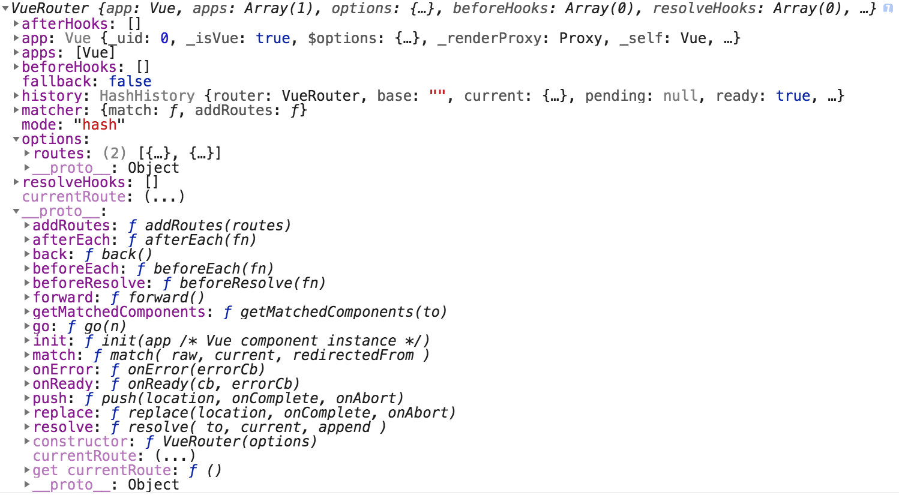

# Vue Router

## 路由干什么用的
根据url的变化切换组件。

## VueRouter Installation

**方法一：本地引入**

```
<script src="/path/to/vue.js"></script>
<script src="/path/to/vue-router.js"></script>
```
**方法二: CDN引入**

```
<script src="https://cdn.jsdelivr.net/npm/vue@2.5.17/dist/vue.js"></script>
<script src="https://unpkg.com/vue-router/dist/vue-router.js"></script>
```

**方法三：NPM引入**
```
$ npm install vue-router

```
如果在一个模块化工程中使用它，必须要通过 Vue.use() 明确地安装路由功能：
```
import Vue from 'vue'
import VueRouter from 'vue-router'

Vue.use(VueRouter)
```


## VueRouter Constructor

**`VueRouter(OPTIONS)`是一个构造函数**

- `VueRouter()`是一个创建路由器的构造函数。
- `VueRouter()`的设计思路是：在组件和路由之间建立映射，并告诉VueRouter()在哪里渲染组件。
- `VueRouter()`和Vue.js的核心深度集成。
- `VueRouter()`让构建单页面应用变得易如反掌。
- 主要功能包括：
  - 签套的路由表
  - 模块化的基于组件的路由配置
  - 路由参数、查询、通配符
  - 基于Vue.js系统的视图过渡效果

```
const router = new VueRouter({
    mode: 配置路由模式
      - 'hash': 使用URL Hash值模拟一个url。 特点：url改变时，页面不会重新加载
      - 'history': 依赖 HTML5 History API完成URL跳转，页面不会重新加载
    base: 设置应用的基路径。(为何官方例子basic在history模式下，页面刷新不会报404?)
      - 默认值:'/'。
      - 自己指定:
    routes: 配置路由规则
      - [ { path: '/home',component: TheHome },{ path: '/',redirect: '/home' } ]
    linkActiveClass:
    linkExactActiveClass:
    scrollBehavior:
    parseQuery:
    fallback:
  })
```
**VueRouter()的属性**

**VueRouter()的方法**


## VueRouter Instance

**创建VueRouter实例对象的语法**

```
const router = new VueRouter(OPTIONS)
```

**VueRouter实例对象的属性**
- router.app :
- router.mode
- router.currentRoute


**VueRouter实例对象的方法**


**将VueRouter实例对象注入到Vue实例中**

```
const vm = new Vue({
  el: "#app",
  router: router
})
```


## 内置组件

**<router-link>**:用于在app中创建导航链接。

- `to`: 指定链接的地址
  - `字符串`:`<router-link to='/about'>`
  - `路由对象`: `<router-link :to="{name:'about'}">`
- `tag`
- `replace`
- `active-class`: 指定链接激活时的类名
  - 默认值：`router-link-active`
- `exact`: Force the link into `exact match mode`
- `event`
- `exact-active-class`: 指定链接确切激活时的类名
  - 默认值：`router-link-exact-active`

例子：
```
<style>
.router-link-active{
    color:red
}
</style>
<router-link to='/' class='router-link-active'>首页</router-link>
<router-link to='/about' class='router-link-active'>关于</router-link>
```
注意：The default active class matching behavior is `inclusive match`,not `exact match`,所以,只要我包含你，我就匹配你。开头路径需要一致，以下路径均会被激活：
- `/about/abc`
- `/about/`
- `/abo` (not actived)
- `/about`
- `/`

**<router-view>**

- `name`


## 路由的应用

**Dynamic Segments**
- one component
- multiple segments
- setting `dynamic segments` in the `path` key of the routes

**Nested Routes**
- 在路由表中，使用`children`属性添加子路由
- 在该路由对应的组件中，设置`<router-view/>`


**Navigation Guards**
- Global Navigation Guards: excute on every route change
- per route Guards: be excuted on specific routes
- in component Guards: be excuted on specific components


## Print VueRouter constructor


## Print Vue Router Instance


## Print $router


## 打印this.$route


