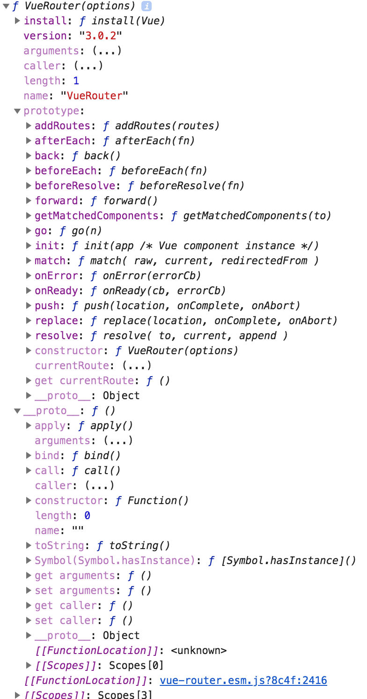
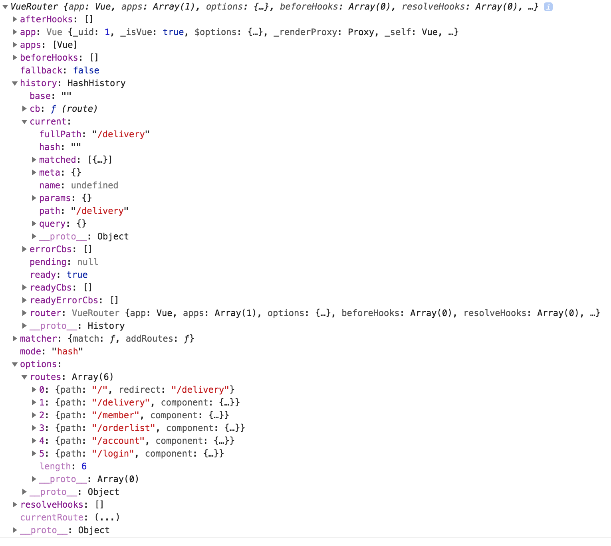
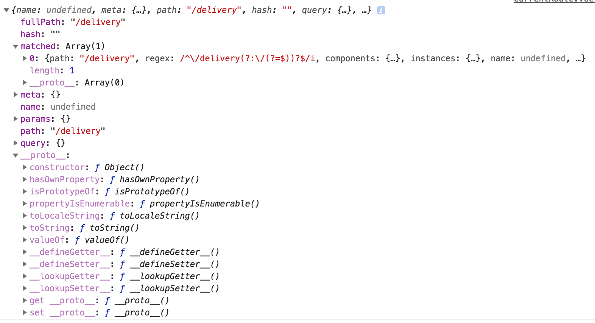

# Vue Router


## Vue Router是什么
- Vue Router是Vue.js官方的路由管理器。
- Vue Router和Vue.js的核心深度集成。
- Vue Router让构建单页面应用变得易如反掌。
- 主要功能包括：
  - 签套的路由表
  - 模块化的基于组件的路由配置
  - 路由参数、查询、通配符
  - 基于Vue.js系统的视图过渡效果

## Vue.js + Vue Router的基本原理
- 在Vue.js中，将组件组合起来构建应用程序。
- 在Vue Router中，将组件映射到路由，并告诉Vue Router在哪里渲染组件。


## 如何安装Vue Router
- **引入** ：引入Vue Router库文件。注意：Vue-router.js文件应在vue.js文件之后。
```
<script src="https://unpkg.com/vue/dist/vue.js"></script>
<script src="https://unpkg.com/vue-router/dist/vue-router.js"></script>
```
- **安装** ：将VueRouter()函数添加到Vue.js中去。
```
Vue.use(VueRouter)
```

## 如何使用Vue Router
- 创建VueRouter实例
```
const router = new VueRouter({
    mode: 'hash', //利用url的hash模拟一个url。特点：url改变时，页面不会重新加载
    mode: 'history', //利用history.pushState API完成URL跳转，页面不会重新加载
    routes: [
      {
        path: '/home',
        component: TheHome
      },
      {
        path: '/course',
        component: TheCourse
      },
      {
        path: '/article',
        component: TheArticle
      },
      {
        path: '/about',
        component: TheAbout
      },
      {
        path: '/',
        redirect: '/home'
      }
    ]
  })
```

- 将VueRouter实例注入到Vue实例中
```
const vm = new Vue({
  el: "#app",
  router,
  components: {
    'main-nav': MainNav,
    'the-home': TheHome,
    'the-course': TheCourse,
    'the-article': TheArticle,
    'the-about': TheAbout
  }
})
```

- 设置链接
- 设置渲染区域


## VueRouter()是一个构造函数
`VueRouter()`构造函数用于创建一个router实例。


```
function VueRouter (options) {
    if ( options === void 0 ) options = {};

    this.app = null;
    this.apps = [];
    this.options = options;
    this.beforeHooks = [];
    this.resolveHooks = [];
    this.afterHooks = [];
    this.matcher = createMatcher(options.routes || [], this);

    var mode = options.mode || 'hash';
    this.fallback = mode === 'history' && !supportsPushState && options.fallback !== false;
    if (this.fallback) {
        mode = 'hash';
    }
    if (!inBrowser) {
        mode = 'abstract';
    }
    this.mode = mode;

    switch (mode) {
        case 'history':
            this.history = new HTML5History(this, options.base);
            break
        case 'hash':
            this.history = new HashHistory(this, options.base, this.fallback);
            break
        case 'abstract':
            this.history = new AbstractHistory(this, options.base);
            break
        default:
            {
            assert(false, ("invalid mode: " + mode));
            }
    }
}
```

## 创建Vue Router的步骤
**第一步：引入vue-router库**
```
import VueRouter from 'vue-router'
```

**第二步：安装路由插件**
```
Vue.use(VueRouter)
```

**第三步：创建Router实例**
```
const router = new VueRouter({
    routes: [
        {
            path: '/',
            component: Home
        }
    ]
})
```
**第四步：将Router实例注入Vue实例中**
```
new Vue({
    router,
    render: h => h(App)
}).$mount('#app')
```

## $router: 路由实例对象

**打印this.$router**


**Router对象简介**

- `Router`对象是VueRouter()的实例对象。


**访问Router对象的方法**

当向`Vue`实例注入`Router`实例之后，可以在任何组件内通过 `this.$router` 访问路由器

## Router实例对象的属性
- `$router.app`:返回`router`对象所在的根实例对象
- `$router.mode`:返回`router`对象的模式
- `$router.currentRoute`: 返回`router`对象的当前路由对象
```
{
  fullPath: "/home",
  hash: "",
  matched: [[object Object] {
  beforeEnter: undefined,
  components: [object Object] {
    default: [object Object] { ... }
  },
  instances: [object Object] {
    default: [object Object] { ... }
  },
  matchAs: undefined,
  meta: [object Object] { ... },
  name: undefined,
  parent: undefined,
  path: "/home",
  props: [object Object] { ... },
  redirect: undefined,
  regex: [object RegExp] {
    keys: []
  }
}],
  meta: [circular object Object],
  name: undefined,
  params: [object Object] { ... },
  path: "/home",
  query: [object Object] { ... }
}
```


## Router实例对象的方法
- `this.$router.push(string|| object)`: 向浏览器的history stack中添加一条新记录
```
new Vue({
    methods: {
    pushEntry(){
      this.$router.push('/products/mac/macbook/all')
    }
  }
})
```
使用对象去描述一个route对象
```
methods: {
    pushEntry(){
      this.$router.push({name: 'about'})
    }
  }
```
- `this.$router.replace()`
- `this.$router.go()`
- `this.$router.back()`
- `this.$router.forward()`
- `this.$router.beforeEach()`


## Navigation Guards
- Global Navigation Guards: excute on every route change
- per route Guards: be excuted on specific routes
- in component Guards: be excuted on specific components


## $route：当前路由对象

**打印this.$route**



**当前路由对象包含的信息有**

- 当前url解析后的信息
- url匹配到的路由记录

**$route对象出现的地方有**

- 组件内：`this.$route`
- 在`$route`观察者回调内
- `router.match(location)`的返回值
- 导航守卫的参数
- `scrollBehavior`方法的参数

## $route对象的属性

- `$route.name`: `string`  the name the current route if it has one
- `$route.path`: `string` the path of the current route
- `$route.fullPath` : `string` the path with the query string and the hash
- `$route.params`: `object` `dynamic segments` and `star segments`
- `$route.query`: `object`  `key/value pairs of the query string`
- `$route.hash`: `string`  `the hash with the # of the current route`
- `$route.matched`: `Array` route records for all nested path segments of the current route


## 组件`<router-link>`
`<router-link>`用于在app中创建导航链接。

**`to`:指定链接的地址为一个路径字符串**
```
<router-link to='/about'>关于</router-link>
```
**`to`:指定链接的地址为一个路由对象**
```
<router-link :to="{name:'about'}">关于</router-link>
```
**`active-class`:指定链接激活时的类名**
- 默认值：`router-link-active`
```
<style>
.router-link-active{
    color:red
}
</style>
<router-link to='/' class='router-link-active'>首页</router-link>
<router-link to='/about' class='router-link-active'>关于</router-link>
```
注意：The default active class matching behavior is `inclusive match`,not `exact match`,所以,只要我包含你，我就匹配你。开头路径需要一致，以下路径均会被激活：
- `/about/abc`
- `/about/`
- `/abo` (not actived)
- `/about`
- `/`


**`exact`:Force the link into `exact match mode`**
```
<router-link to='/' class='router-link-active' exact>首页</router-link>
<router-link to='/about' class='router-link-active'>关于</router-link>
```

**`exact-active-class`:指定链接确切激活时的类名**

- 默认值：`router-link-exact-active`
- 确切激活：不添加exact模式也可以确切激活。如
```
<style>
.router-link-active{color:red}
.router-link-exact-active{color:green}
</style>

// exact-active when click this, not exact-active when click another
<router-link to='/about'>/about</router-link>
//exact-active when click this
<router-link to='/about/abc'>/about/abc</router-link>
```

## 组件`<router-view>`


## 路由的应用

**Dynamic Segments**
- one component
- multiple segments
- setting `dynamic segments` in the `path` key of the routes

**Nested Routes**
- 在路由表中，使用`children`属性添加子路由
- 在该路由对应的组件中，设置`<router-view/>`
