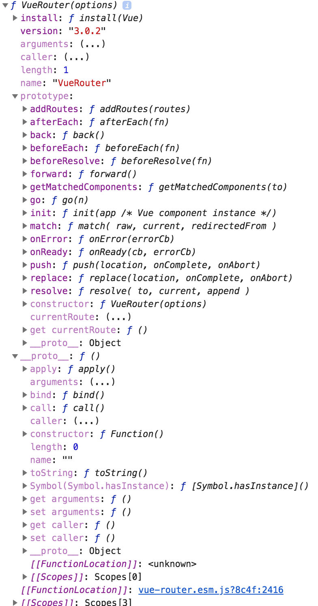

# Vue Router Basic

## Vue Router简介
- 有了路由器，可以管理家里的每台电脑
- 有了Vue Router，可以管理项目中的每个组件

## VueRouter()是一个构造函数

## Router实例

## Router实例

## route对象

## 组件

- `<router-link>`
    - 用途：在应用中创建导航链接。
    - `to`属性
    - `tag`属性
    - `active-class`
    - `exact-active-class`
    - `exact`
    - `replace`
    - `append`
    - `event`

- `<router-view>`
    - 用途：在应用中渲染组件。(functional组件)
    - `name`
