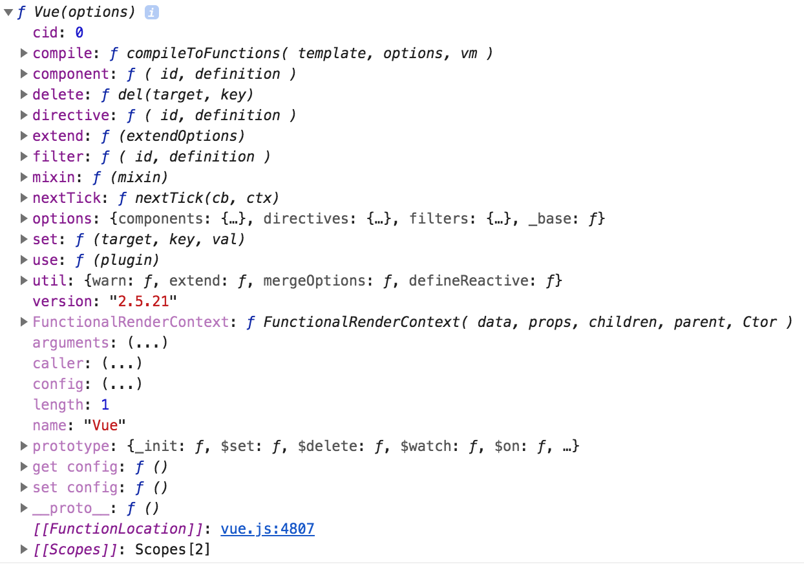
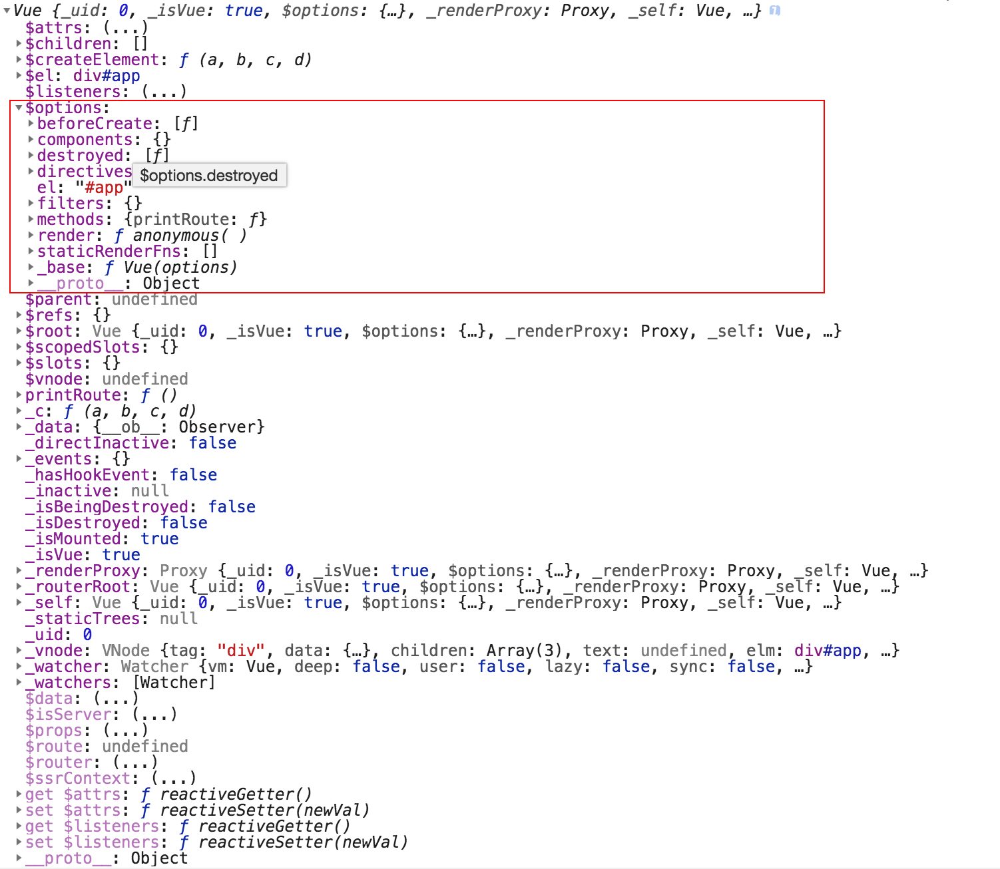
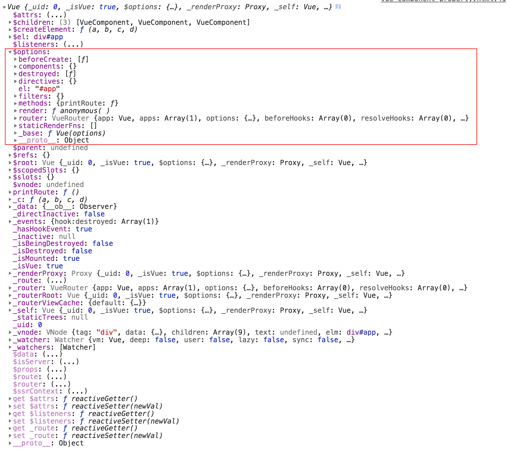
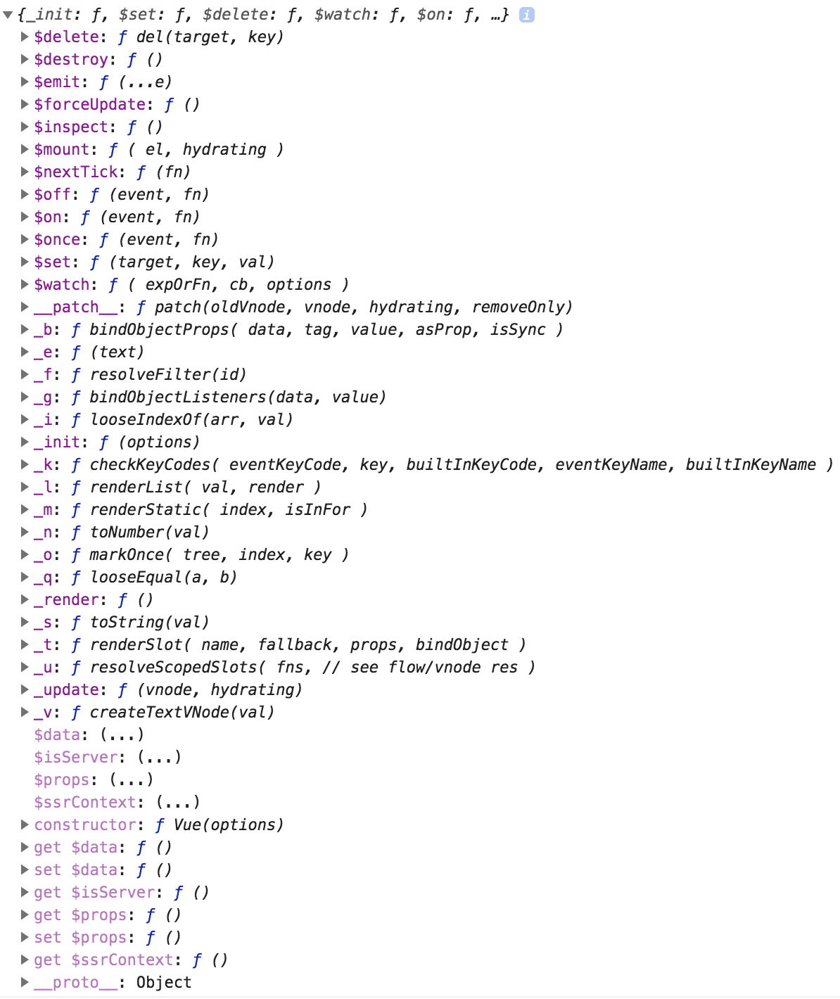

# Vue教程
- Vue Installation
- Vue Constructor
- Vue Instance


## Vue Installation

**方法一：直接下载引入**

```
<script src = './js/vue.js'></script>
```
- `Vue`会被注册为一个全局变量。

**方法二：使用CDN引入**

```
<script src="https://cdn.jsdelivr.net/npm/vue@2.5.17/dist/vue.js"></script>
```

**方法三：在webpack下使用NPM引入**

```
$ npm install vue
```

**方法四：使用VUE-CLI引入**

```
$ npm install -g @vue/cli
$ vue create projectName
```

检测是否安装成功
```
$ vue --version
```

## Vue Constructor
**Vue($Options)是一个构造函数**

>构造函数：在JS中，如果一个函数用来初始化一个新建对象，那么这么函数就是构造函数。

我们把APP看做一个对象
- Vue()实现了创建App对象流程的标准化
- $options是一个对象：使用选项创建你想要的行为。

```
const vm = new Vue({
  //DOM类： 用于创建DOM结构
    el:
    template:
    render:
    renderError:
  //数据类：用于向DOM中注入数据(数据可以是响应的)
    data:
    props:
    propsData:
    methods:
    computed:
    watch:
  //生命周期钩子：在实例对象被创建的整个过程中(前、中、后)可以执行我们自己代码的函数。
    beforeCreate:
    created:
    beforeMount:
    mounted:
    beforeUpdate:
    updated:
    actived:
    deactived:
    beforeDestroy:
    destroyed:
    errorCaptured:
  //资源
    components:
    directives:
    filters:
  //组合
    parent:
    mixins:
    extends:
    provide:
  //其他
    name:
    model:
    delimiters:
    functional:
    inheritAttrs:
    comments:
})
```

**Vue()的属性**

主要用来对Vue进行全局配置；
- Vue.config: 是一个对象。对Vue构造函数进行全局配置(如：日志与警告、是否开启开发工具等)
- Vue.version: 获取Vue的版本号，对插件开发者非常有用。

**Vue()的方法**

主要用来扩展Vue的功能；
- Vue.extend(): 基础Vue构造器，用于创建“子类”。(组件就是子类)
- Vue.use(): 安装Vue.js插件。
- Vue.component(): 注册全局组件、获取全局组件。
- Vue.filter(): 注册全局过滤器、获取全局过滤器。
- Vue.directive(): 注册全局指令、获取全局指令。
- Vue.mixin(): 注册全局混入。
- Vue.compile(): 在render()函数中编译模板字符串。
- Vue.nextTick():
- Vue.observable(): 让一个对象可响应。
- Vue.set(): 向响应式对象上添加新属性。
- Vue.delete(): 删除对象的属性。

## Vue Instance
一个Vue实例就是一个对象，里面保存了要管理的DOM和数据。只要数据发生变化，DOM就会自动更新。

**创建实例对象的语法**

```
const vm = new Vue($Options)
```
**vm的属性**
- 第一组
  - vm.$data
  - vm.$props
  - vm.$isServer
  - vm.$route: 当前路由对象。(若未添加VueRouter，则返回undefined) 包含以下信息
    - $route.fullPath:返回解析后的URL(包含路径+查询字符串+hash字符串)
    - $route.path:返回当前路由的路径部分(端口号后面，查询字符串前面)
    - $route.query:
    - $route.hash:
    - $route.params:
    - $route.matched:
    - $route.name
  - vm.$router: 路由对象。
  - vm.$ssrContext
  - vm.get $attrs
  - vm.set $attrs
  - vm.get $listeners
  - vm.set $listeners
- 第二组
  - vm.$attrs
  - vm.$children
  - vm.$createElement
  - vm.$el
  - vm.$listeners
  - vm.$options
  - vm.$parent
  - vm.$refs
  - vm.$root
  - vm.$scopedSlots
  - vm.$slots
  - vm.$vnode
- 第三组
  - `_c`
  - `_data`
  - `_directInactive`
  - `_events`
  - `_hasHookEvent`
  - `_inactive`
  - `_isBeingDestroyed`
  - `_isDestroyed`
  - `_isMounted`
  - `_isVue`
  - `_renderProxy`
  - `_routerRoot`
  - `_self`
  - `_staticTrees`
  - `_uid`
  - `_vnode`
  - `_watcher`
  - `_watchers`

**vm的方法**
- `vm.__proto__.$watch`
- `vm.__proto__.$set`
- `vm.__proto__.$delete`
- `vm.__proto__.$on`
- `vm.__proto__.$once`
- `vm.__proto__.$off`
- `vm.__proto__.$emit`
- `vm.__proto__.$mount`
- `vm.__proto__.$forceUpdate`
- `vm.__proto__.$nextTick`
- `vm.__proto__.$destroy`


## Print Vue Constructor


## Print Vue instance


## Print Vue instance with router


## Print Vue Prototype

