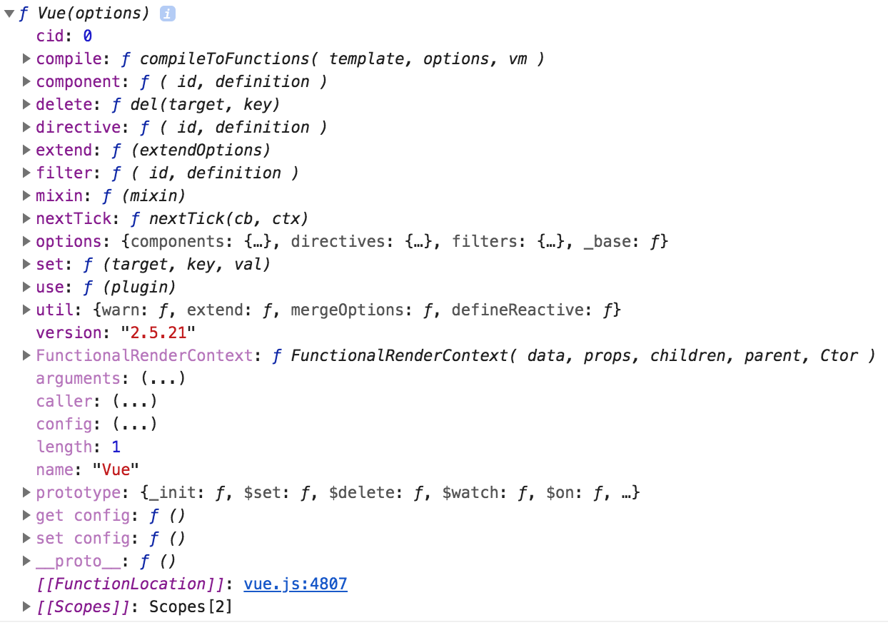

# Vue Constructor

## 关于Vue Constructor的理解
- 首先，我们把App看做一个对象。
- `Vue()`将App对象创建变为标准化流程。

## Print Vue Constructor

## Vue.component('component-name',Vue.extend({options}))
- 用途：注册组件(global)

## Vue.extend({options})
- 用途:创建一个“子构造函数”(子类)。
- `{options}`: 一个包含组件选项的对象。
  - data: 必须是函数

## Vue.directive('id',[function|object])
- 用途: 注册全局指令
