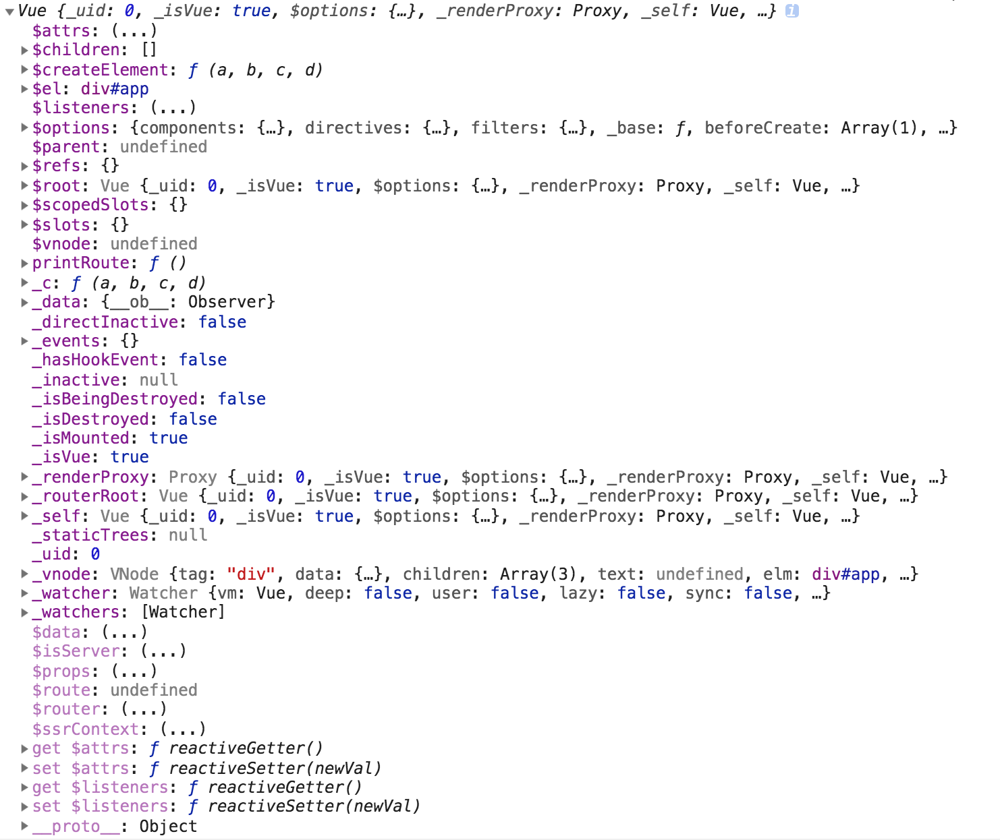

# Vue Constructor
- Vue()是一个构造函数。
- Vue()构造函数的属性
- Vue()构造函数的方法
- vm实例对象就是我们的app
- vm实例对象的属性
- vm实例对象的方法


## 搞明白'Vue()是一个构造函数'这句话的意思
首先，你要知道构造函数的概念。
>构造函数：在JS中，如果一个函数用来初始化一个新建对象，那么这么函数就是构造函数。

其次，既然Vue()是一个构造函数，那么Vue()是用来初始化一个新建对象的。这个新建对象是怎样的一个对象？有什么特点？我们可以从Vue()函数的属性和方法上去探寻。
- Vue()的属性
  - Vue.config: 是一个对象。对Vue构造函数进行全局配置(如：日志与警告、是否开启开发工具等)
  - Vue.version: 获取Vue的版本号，对插件开发者非常有用。
- Vue()的方法
  - Vue.extend(): 基础Vue构造器，用于创建“子类”。(组件就是子类)
  - Vue.use(): 安装Vue.js插件。
  - Vue.component(): 注册全局组件、获取全局组件。
  - Vue.filter(): 注册全局过滤器、获取全局过滤器。
  - Vue.directive(): 注册全局指令、获取全局指令。
  - Vue.mixin(): 注册全局混入。
  - Vue.compile(): 在render()函数中编译模板字符串。
  - Vue.nextTick():
  - Vue.observable(): 让一个对象可响应。
  - Vue.set(): 向响应式对象上添加新属性。
  - Vue.delete(): 删除对象的属性。

我们发现构造函数Vue()的：
  - 属性：主要用来对Vue进行全局配置；
  - 方法：主要用来扩展Vue的功能；

对于使用Vue()创建一个对象到底是怎样一个对象，更加一头雾水？别急，先看看怎样创建一个实例化对象：
创建实例化对象语法：
```
const vm = new Vue({$Options})
```
接下来，我们看看`$options`选项对象都有哪些选项：
```
const vm = new Vue({
  //DOM类： 用于创建DOM结构
    el:
    template:
    render:
    renderError:
  //数据类：用于向DOM中注入数据(数据可以是响应的)
    data:
    props:
    propsData:
    methods:
    computed:
    watch:
  //生命周期钩子：在实例对象被创建的整个过程中(前、中、后)可以执行我们自己代码的函数。
    beforeCreate:
    created:
    beforeMount:
    mounted:
    beforeUpdate:
    updated:
    actived:
    deactived:
    beforeDestroy:
    destroyed:
    errorCaptured:
  //资源
    components:
    directives:
    filters:
  //组合
    parent:
    mixins:
    extends:
    provide:
  //其他
    name:
    model:
    delimiters:
    functional:
    inheritAttrs:
    comments:
})
```
通过选项对象，我们可以看出：这个实例对象不就是一个APP吗？至此，我们对Vue()是一个构造函数的理解是：
- 使用Vue()创建的实例对象就是我们的APP。
- 构造函数`Vue()`为我们实现了创建App对象的标准化流程。

## vm的属性

## vm的方法


## Print Vue Constructor


## Print Vue instance


## Print Vue instance with router

