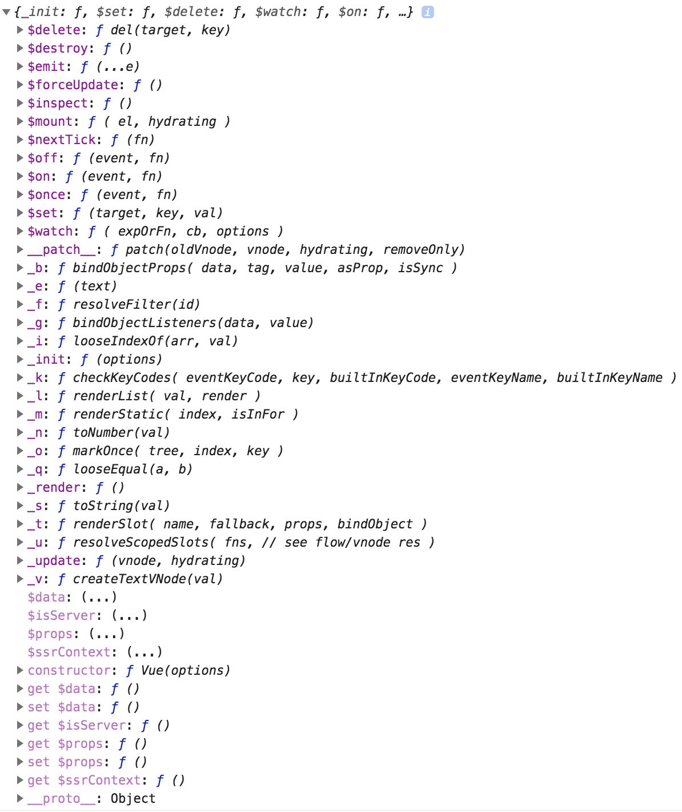

# Vue Prototype

## Print Vue Prototype

## Vue.prototype.$mount()

## Vue.prototype.$on()

## Vue.prototype.$once()

## Vue.prototype.$emit()

## Vue.prototype.$watch()

## Vue.prototype.$nextTick()
